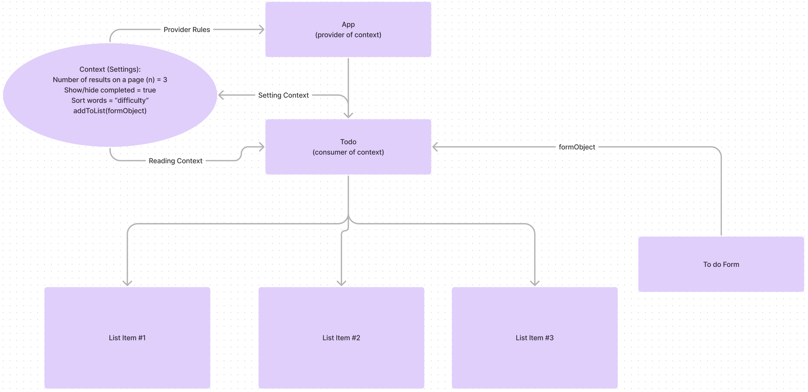

# Todo-App

## Getting Started

### Requirements

For development, you will only need [Node](http://nodejs.org/) installed in your
environment.
Please use the appropriate [Editorconfig](http://editorconfig.org/) plugin for your
Editor (not mandatory).

### Install

    git clone git@github.com:Arvoya/todo-app.git
    cd PROJECT
    npm install

### Configure app

<!-- Any environment configuration steps. -->

### Start & watch

    npm run dev
    npm start

## Architecture



```text
├── .eslintrc.cjs
├── .gitignore
├── README.md
├── index.html
├── package-lock.json
├── package.json
├── public
│   └── uml.png
├── src
│   ├── App.tsx
│   ├── Components
│   │   ├── Footer
│   │   │   └── index.tsx
│   │   ├── Header
│   │   │   └── index.tsx
│   │   ├── List
│   │   │   └── index.tsx
│   │   ├── Settings
│   │   │   └── index.tsx
│   │   └── Todo
│   │       ├── Todo.test.jsx
│   │       └── index.tsx
│   ├── Context
│   │   ├── Items
│   │   │   └── index.tsx
│   │   └── Settings
│   │       ├── Settings.test.tsx
│   │       └── index.tsx
│   ├── hooks
│   │   ├── form.js
│   │   └── styles.js
│   └── main.jsx
├── tsconfig.json
├── tsconfig.node.json
└── vite.config.ts
```

### Languages & tools

<!-- Explain what tools are used. -->

## Change Log

1.0.0

## Collaborators

Brock Britton